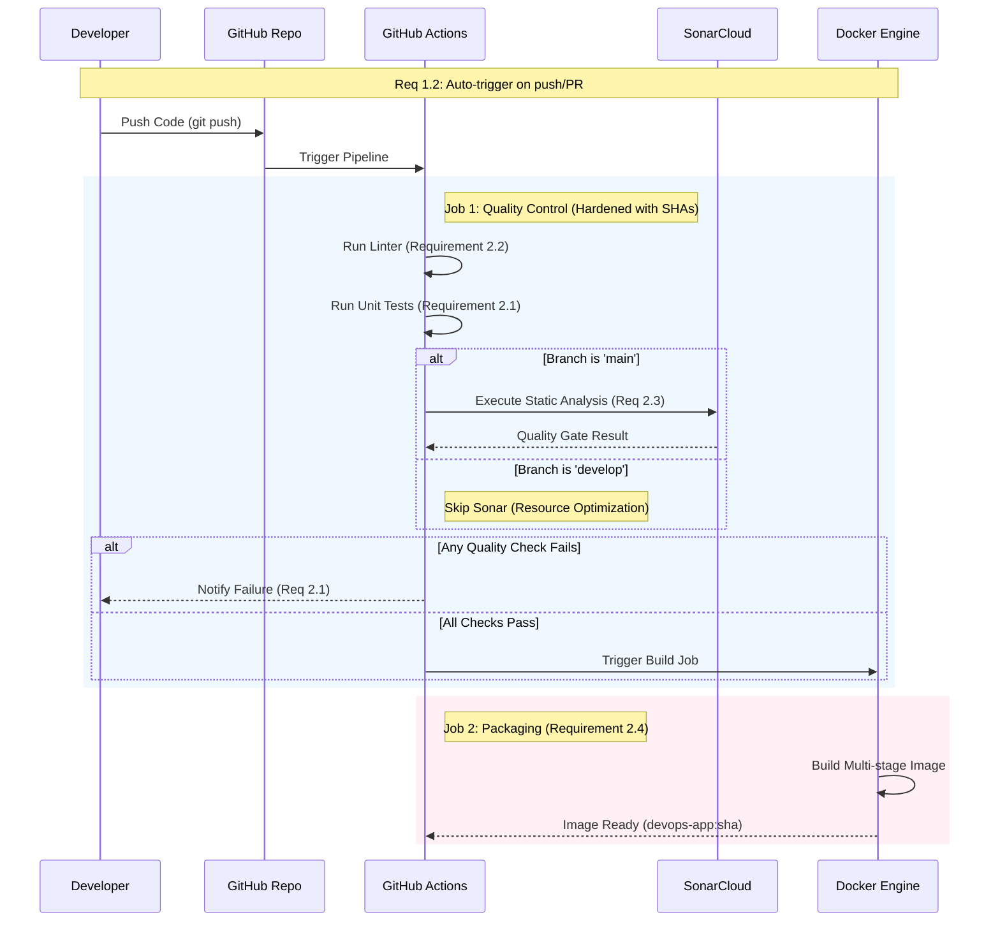

### 2.3 Pipeline Sequence Diagram
This diagram illustrates the automated CI/CD flow, satisfying Requirement 2.3.

```mermaid
sequenceDiagram
    participant Dev as Developer
    participant GH as GitHub Repo
    participant GA as GitHub Actions
    participant Sonar as SonarCloud
    participant Docker as Docker Engine

    Note over Dev, Docker: Req 1.2: Auto-trigger on push/PR

    Dev->>GH: Push Code (git push)
    GH->>GA: Trigger Pipeline

    rect rgb(240, 248, 255)
        Note right of GA: Job 1: Quality Control (Hardened with SHAs)
        GA->>GA: Run Linter (Requirement 2.2)
        GA->>GA: Run Unit Tests (Requirement 2.1)
        
        alt Branch is 'main'
            GA->>Sonar: Execute Static Analysis (Req 2.3)
            Sonar-->>GA: Quality Gate Result
        else Branch is 'develop'
            Note right of GA: Skip Sonar (Resource Optimization)
        end

        alt Any Quality Check Fails
            GA-->>Dev: Notify Failure (Req 2.1)
        else All Checks Pass
            GA->>Docker: Trigger Build Job
        end
    end

    rect rgb(255, 240, 245)
        Note right of GA: Job 2: Packaging (Requirement 2.4)
        Docker->>Docker: Build Multi-stage Image
        Docker-->>GA: Image Ready (devops-app:sha)
    end
```